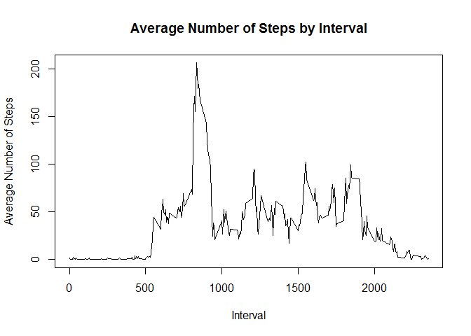
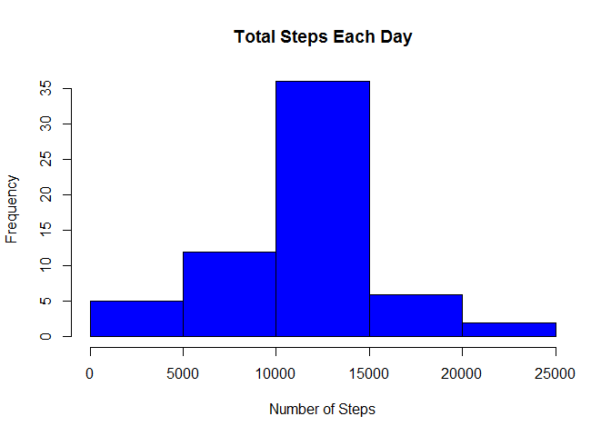

# Reproducible Research: Peer Assessment 1

##  Loading and preprocessing the data

Download, unzip and load data into dataframe.


```r
if(!file.exists("activity.csv")) {
        temp <- tempfile()
        download.file("http://d396qusza40orc.cloudfront.net/repdata%2Fdata%2Factivity.zip",temp)
        unzip(temp)
        unlink(temp)
}

activity  <- read.csv("activity.csv")

summary(activity)
```

```
##      steps                date          interval     
##  Min.   :  0.00   2012-10-01:  288   Min.   :   0.0  
##  1st Qu.:  0.00   2012-10-02:  288   1st Qu.: 588.8  
##  Median :  0.00   2012-10-03:  288   Median :1177.5  
##  Mean   : 37.38   2012-10-04:  288   Mean   :1177.5  
##  3rd Qu.: 12.00   2012-10-05:  288   3rd Qu.:1766.2  
##  Max.   :806.00   2012-10-06:  288   Max.   :2355.0  
##  NA's   :2304     (Other)   :15840
```

## What is mean total number of steps taken per day?

* Calculate the total number of steps taken per day
* Make a histogram of the total number of steps taken each day
* Calculate and report the mean and median of the total number of steps taken per day


```r
# Summarize total number of steps per day
steps_by_day <- aggregate(steps ~ date, activity, sum)
# Plot histogram
hist(steps_by_day$steps, main = paste("Total Steps Each Day"), col="green", xlab="Number of Steps")
```

<!-- -->

```r
#calculate Mean & Median of the total number of steps taken per day
meanSteps <- mean(steps_by_day$steps)
medianSteps <- median(steps_by_day$steps)

cat("Average steps taken per day is ", meanSteps, "\nMedian steps taken per day is ", medianSteps)
```

```
## Average steps taken per day is  10766.19 
## Median steps taken per day is  10765
```

## What is the average daily activity pattern?

* Make a time series plot (i.e. type = "l") of the 5-minute interval (x-axis) and the average number of steps taken, averaged across all days (y-axis)
* Which 5-minute interval, on average across all the days in the dataset, contains the maximum number of steps?


```r
# Average number of steps taken
steps_by_interval <- aggregate(steps ~ interval, activity, mean)
# Plot average steps by interval
plot(steps_by_interval$interval,steps_by_interval$steps, type="l", xlab="Interval", ylab="Average Number of Steps",main="Average Number of Steps by Interval")
```

<!-- -->

```r
#calculate and print the max interval 
max_interval <- steps_by_interval[which.max(steps_by_interval$steps),1]

cat("Interval (on Avg) with maximum number of steps is ", max_interval)
```

```
## Interval (on Avg) with maximum number of steps is  835
```

## Imputing missing values

* Calculate and report the total number of missing values in the dataset (i.e. the total number of rows with NAs)
* Devise a strategy for filling in all of the missing values in the dataset. The strategy does not need to be sophisticated. 
* Create a new dataset that is equal to the original dataset but with the missing data filled in.
* Make a histogram of the total number of steps taken each day and Calculate and report the mean and median total number of steps taken per day. Do these values differ from the estimates from the first part of the assignment? What is the impact of imputing missing data on the estimates of the total daily number of steps?

My strategy for filling in NAs will be to substitute the missing steps with the average for each interval..


```r
#Number of NAs in original data set
missingValue <- nrow(activity[is.na(activity$steps),])

cat("Number of missing values in the dataset is", missingValue)
```

```
## Number of missing values in the dataset is 2304
```

```r
# Filling in NAs with average of each interval
imputed_data <- transform(activity, steps = ifelse(is.na(activity$steps), steps_by_interval$steps[match(activity$interval, steps_by_interval$interval)], activity$steps))

# New dataset with filled in missing data
summary(imputed_data)
```

```
##      steps                date          interval     
##  Min.   :  0.00   2012-10-01:  288   Min.   :   0.0  
##  1st Qu.:  0.00   2012-10-02:  288   1st Qu.: 588.8  
##  Median :  0.00   2012-10-03:  288   Median :1177.5  
##  Mean   : 37.38   2012-10-04:  288   Mean   :1177.5  
##  3rd Qu.: 27.00   2012-10-05:  288   3rd Qu.:1766.2  
##  Max.   :806.00   2012-10-06:  288   Max.   :2355.0  
##                   (Other)   :15840
```

```r
# Count total steps per day
steps_by_day_imp <- aggregate(steps ~ date, imputed_data, sum)
hist(steps_by_day_imp$steps, main = paste("Total Steps Each Day"), col="blue", xlab="Number of Steps")
```

<!-- -->

```r
# calculate the new median and Mean
meanSteps_imp <- mean(steps_by_day_imp$steps)
medianSteps_imp <- median(steps_by_day_imp$steps)

cat("Average steps taken per day for imputed values is ", meanSteps_imp, "\nMedian steps taken per day for imputed values is ", medianSteps_imp)
```

```
## Average steps taken per day for imputed values is  10766.19 
## Median steps taken per day for imputed values is  10766.19
```

Calculate the difference between mean & median between imputed and non-imputed data and the total difference


```r
# calculate mean and median difference
mean_diff <- meanSteps_imp - meanSteps
med_diff <- medianSteps_imp - medianSteps

# calculate the total difference
total_diff <- sum(steps_by_day_imp$steps) - sum(steps_by_day$steps)

cat("Difference in mean for imputed and non-imputed data is ", mean_diff, "\nDifference in median for imputed and non-imputed data is ", med_diff, "\nTotal difference in steps for imputed and non-imputed data is", total_diff)
```

```
## Difference in mean for imputed and non-imputed data is  0 
## Difference in median for imputed and non-imputed data is  1.188679 
## Total difference in steps for imputed and non-imputed data is 86129.51
```

## Are there differences in activity patterns between weekdays and weekends?

* Create a new factor variable in the dataset with two levels - "weekday" and "weekend" indicating whether a given date is a weekday or weekend day.
* Make a panel plot containing a time series plot (i.e. type = "l") of the 5-minute interval (x-axis) and the average number of steps taken, averaged across all weekday days or weekend days (y-axis). 


```r
weekdays <- c("Monday", "Tuesday", "Wednesday", "Thursday", "Friday")

# Assign Day od week to the imputed data
imputed_data$dow = as.factor(ifelse( weekdays(as.Date(imputed_data$date)) %in% weekdays, "Weekday", "Weekend"))

# Find the mean
steps_by_interval_imp <- aggregate(steps ~ interval + dow, imputed_data, mean)

library(lattice)

# Plot data by Weekday & Weekend
xyplot(steps_by_interval_imp$steps ~ steps_by_interval_imp$interval|steps_by_interval_imp$dow, 
       main="Average Steps per Day by Interval",xlab="Interval", ylab="Steps",layout=c(1,2), type="l")
```

<!-- -->

The steps are different for weekday and Weekend. The test object is more active earlier in the day  during weekdays, but the object is more active throughout the weekends probably because the oject is working during the weekdays, hence moving less during the day.
